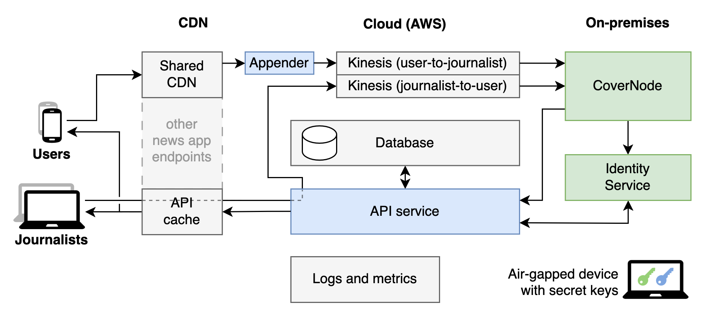

# CoverDrop: a secure messaging system for newsreader apps

CoverDrop is a system designed to allow users of news organisations' mobile apps to contact journalists confidentially and without leaving evidence that they are doing so.

## Overview

The CoverDrop system consists of four major components:

- A module within the news organisation's regular mobile apps
- A cloud-based API
- The CoverNode: a set of services run from a secured location
- A desktop application used by journalists at the news organisation

CoverDrop provides strong plausible deniability by making every instance of the news organisation's public mobile app behave the same way, whether it is used for secure communication or for normal news consumption:

|  |
|:--:| 
|Overview of the full architecture including mobile devices and the back-end components.
The web services are either provided by third-parties (gray); written by us and running on third-party cloud infrastructure (blue); or services running on on-premises hardware (green). The arrows in this chart indicate logical flow of messages that include messages and cryptographic key information. The on-premises services do not allow any incoming connection and instead use a pull-based approach.|

- In a CoverDrop implementation, at regular intervals, every copy of the news organisation's app exchanges small quantities of encrypted information with that news organisation's servers. These "cover messages" usually contain meaningless ciphertext.
- When a source writes a message for a journalist, their message plus that source's automatically generated public key is encrypted using the public key of the journalist. That ciphertext is then swapped in for one of the routine cover messages. Both source and cover messages are encrypted in the same way, are the same length, and are sent at the same times. So from the perspective of a network observer they are indistinguishable.
- These messages are channelled from the CDN through to secure servers at the news organisation. There, a first layer of encryption is removed to distinguish real messages from cover messages. The servers then routinely issue collections of messages in dead drops to applications used by journalists. The dead drops may contain a mixture of real messages and fake ones to pad each dead drop to a uniform size. If a journalist receives a dead drop containing a message encrypted with that journalist's public key, they will be able to remove the final layer of encryption and read the message.
- Journalists can also reply to these messages, since they include the source's public key. Replies from journalists are handled in a similar process to those from sources to journalists.
- The message storage vaults on users' apps are modified at the same times, are the same size, and are encrypted in the same way whether they contain real messages or not. Consequently, if a device used for secure communication was seized, so long as the decryption passphrase is not known, that device will show no evidence of whether or not it has been used for source/journalist communication.

We have written a [white paper](https://www.coverdrop.org/coverdrop_guardian_implementation_june_2025.pdf) that details the design and architecture together with researchers at the Department of Computer Science and Technology at the University of Cambridge. It is available on: https://www.coverdrop.org/

## Repository

> [!NOTE]
> This respository is a public copy of our internal source-of-truth respository. All changes to our main branch are automatically synchronized across.

The implementation is split into separate clients and services.

- `admin` is a CLI tool for creating new key pairs for the backend.
- `android` contains the Android library and integration sample app.
- `api` is a REST API which is the central interaction point for clients and the CoverNode.
- `cdk` includes the AWS infrastructure resources.
- `client` provides CLI applications that emulate the interaction of users and journalists.
- `common` contains all common code including wrappers for the cryptographic primitives.
- `covernode` is the CoverNode implementation.
- `integration-tests` includes the code that spins up a high-fidelity environment for integration testing.
- `ios` contains the iOS library and sample app.
- `identity-api` is the REST API for automatic journalist and CoverNode identity key rotation.
- `journalist-client` is the desktop application used by journalists to communicate with sources.
- `journalist-vault` is the encrypted database used by journalists to store cryptographic keys and messages.
- `tasks` includes scheduled tasks running in AWS.
- `u2j-appender` is a service for taking messages from mobile clients and appending them to our streams.

More detailed documentation on the project, from the cryptographic primitives to the description of the individual components that make up the system, can be found in the [`docs`](./docs) folder.

## Screenshots

|  |  |  |  |
| --- | --- | --- | --- |
| Start screen of the CoverDrop feature | Generated passphrase for the vault | Composing a secure message | An on-going conversation with a journalist |

## Issues and feedback

Authorised users can create issues in this repository. However, at this time we cannot accept pull requests. To send us feedback or to report a problem you can email coverdrop.feedback@theguardian.com. For feedback that comprises sensitive information you can also use the security-related email address below.

## Security

The security of CoverDrop is very important to us and we acknowledge that no system can provide absolute security and is free from bugs. Thus, we welcome responsible disclosures by security researchers that help us to improve CoverDrop and protect its users.

We are particularly interested in issues that affect the confidentiality and integrity of messages, the anonymity of network traffic, and the plausibly-deniable encryption in the apps. One area of constant improvement are side-channels caused by other components of the integrating news reader apps, and we consider this an on-going work with no existing definite solution.

To let us know about security issues we would prefer you email us under encryption. Please write to coverdrop.security@theguardian.com and use the public key with the fingerprint `853F 7EFF 332F DA4F 66ED  CD83 3CA0 0C56 15FA 4518`.

## Cryptography notice

The CoverDrop project includes cryptographic software. The country in which you currently reside may have restrictions on the import, possession, use, and/or re-export to another country, of encryption software. BEFORE using any encryption software, please check your country's laws, regulations and policies concerning the import, possession, or use, and re-export of encryption software, to see if this is permitted. See http://www.wassenaar.org/ for more information.

The U.S. Government Department of Commerce, Bureau of Industry and Security (BIS), has classified this software as Export Commodity Control Number (ECCN) 5D002.C.1, which includes information security software using or performing cryptographic functions with asymmetric algorithms. The form and manner of this distribution makes it eligible for export under the License Exception ENC Technology Software Unrestricted (TSU) exception (see the BIS Export Administration Regulations, Section 740.13) for both object code and source code.

## License

This CoverDrop repository is available under the [Apache License 2.0](LICENSE.md).
