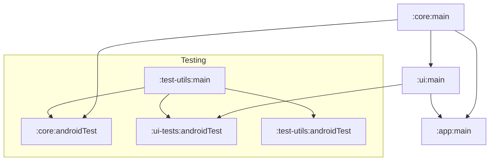

# README: Android

This folder contains multiple Android modules.
They provide both the `:core` and `:ui` library modules that are to be integrated in the main newsreader app.
It also contains a reference app that we use for developing, evaluation, and the audit.

## Setup

This project follows a standard Android project setup.

### Install Android Studio

[Android Studio](https://developer.android.com/studio/index.html) is the official Integrated
Development Environment for Android app development and it's based on IntelliJ IDEA.
This project will work with the latest release of Android Studio from the stable channel

### Import the project

Pull a recent version of this repository using `git clone git@github.com:guardian/coverdrop.git`.
In Android Studio use the "Import project" option, selecting the `android` directory.

You can develop using an emulator or a physical device.
You can create a new emulator from within Android Studio.
Any OS version that the wizard recommends is good; and newer is generally better.
Alternatively, you can connect a real device via USB.
See [this Android guide](https://developer.android.com/studio/run/device) for more information.

### From the CLI

You can alternatively, execute most build operations from the command line.
For instance, this installs the debug version:

```
./gradlew :app:installDebug
```

## Overview

This Android project contains five modules in total.
Of these, `core` and `ui` are relevant for the integrating app:

- `core` is a library module which exports a view of the underlying API and data storage through
  repositories.
- `ui` is a library module which implements the UI components including the screens and view models. It also contains the main dependency injection code.

For our developing and testing we have three additional modules:

- `app` is the reference app that showcases the integration of the `core` and `ui` module.
- `ui-tests` contains the UI tests for the `ui` module. It is a separate module, because the Hilt
  injection for the UI tests works better in an application module.
- `test-utils` contains utilities for testing the `core` and `ui` module such as the integration
  test vectors.

The dependencies are illustrated in the following diagram:



The reference app can be built in different types.
All build types other than `debug` map to `release` for their dependencies.
All build types by default point to the CODE (i.e. staging) endpoints.

- `debug`: Standard for regular development and fully debuggable; points to CODE
- `release`: Mimics the production build to the maximum extent possible; points to PROD
- `ux`: Like release, but allows for screen capture; points to PROD

## Developing against a local stack

The following steps allow you to run the sample Android app against a local CoverDrop stack. 
Under normal circumstances you should develop against the CODE stack, which means you can skip these steps.

- Iff you want to develop the Android app against a custom local stack you'll need to get the dev
  environment running using `./infra/scripts/set-up-dev.sh`.
- Start the cloud service tunnels using `./infra/cloud/scripts/dev/minikube-tunnel.sh`.
- Every time you reopen the tunnels you will need to run`./scripts/create_coverdrop_properties.sh` 
  to create the local `coverdrop-dev.properties` (git-ignored) file that contains the local test settings (e.g. API base url).
    - By default the script uses your primary network interface IP address for the base URL
    - Change the last line to `coverdrop.local_test_mode_enabled=true` to enable using the values
      from the `coverdrop-dev.properties` file.
    - Otherwise, the app will use the values from the `coverdrop-production.properties` file.
- Run the sample app from Android Studio.

Then, have a go at running it with a debugger (set some break points within the repository) or check
out the available profilers to see events in real time.

## Testing

The project comes with Instrumentation Tests for both modules `app` and `core`.
The former are usually UI tests where the latter are testing individual components such as
the `SecureElement` or `AesCipher`.

All tests run as part of the CI pipeline when making changes within the `android/` folder.

We opted for Instrumentation Tests as we require for most tests that the code runs on a real device.
This is particular true because many underlying components depend on loading the libsodium shared
library file or accessing the secure element.
Some tests expose different code path when run on an emulator versus a real device.
For instance, the encrypted storage will use the Sloth library (and hence the Secure Element) on
compatible devices whereas on emulators it will fallback on simpler encryption using Argon2 and longer passphrases.

One can run all tests locally with Gradle and a emulator or real device.
This can be done within Android Studio or via the CLI:

```
$ ./gradlew connectedAndroidTest

> Task :app:connectedDebugAndroidTest
Starting 2 tests on pixel2_api28_nogoogle(AVD) - 9

> Task :core:connectedDebugAndroidTest
Starting 43 tests on pixel2_api28_nogoogle(AVD) - 9

com.theguardian.coverdrop.core.crypto.SecureElementTest > whenEncryptDecryptWithFlippingBitInIv_thenThrowsInvalidTag[pixel2_api28_nogoogle(AVD) - 9] SKIPPED 
[... more skipped tests ...]
com.theguardian.coverdrop.core.crypto.SecureElementTest > whenEncryptDecryptWithResettingKey_thenThrowsInvalidTag[pixel2_api28_nogoogle(AVD) - 9] SKIPPED 

BUILD SUCCESSFUL in 35s
108 actionable tasks: 6 executed, 102 up-to-date
```

### Screenshots

Some UI tests capture screenshots at key moments that help debugging test failures.
They are stored on the device inside a `screenshots` directory within the instrumentation test package's files folder.

### Editing copy

As per Android best practices, we store all copy in the [`res/values/strings.xml`](ui/src/main/res/values/strings.xml) file.
The copy for the help screens is stored in a custom markup language in the [`res/raw/help*.txt`](ui/src/main/res/raw/) files.

You can edit those files on GitHub and then create a PR.
The PR will trigger the build of an APK file (which you can install locally to test) and also creates a ZIP archive with screenshots to preview your changes.
In case the UI tests fail, inspect the error messages whether it might be due to a syntax error in the help screen markup files.
However, the UI tests might also fail for unrelated reasons and sometimes restarting them is all it takes to resolve the issue.

## Security

In addition to the main protocol and encrypted storage, the app includes additional defense-in-depth features.
The following list enumerates the most prominent and important ones that are relevant for development:

- We make sure that there are no accidental `Log` by grepping for all instances and comparing them to a allowlist using `./scripts/ensure_no_logcat_calls.sh` in CI.
- We set `window.addFlags(LayoutParams.FLAG_SECURE)` for the main activity to disable screenshots and blank the preview when switching apps (disabled for the UX build type).
- We silence `ActivityLifecycleCallbacks` to third-party libraries (e.g. usage metrics) using a `SilenceableLifecycleCallbackProxy`.
- We silence `UncaughtExceptionHandler` handlers (e.g. regular crash-reporting) using a `SilenceableUncaughtExceptionHandler`.
- We monitor for interference or insecure device setup. This is implemented in `IntegrityGuard` and results in a dismissible warning. Covered aspects include:
  - The APK is debuggable or a debugger is connected.
  - The device is likely rooted.
  - There is an overlay displayed over the app.
  - The device has no screen lock.
- We use SSL pinning against the Root CAs of the endpoints.
- We check for vulnerabilities in our dependencies using `org.owasp.dependencycheck` and fail on CVSS of 7.0 and higher.

## Publishing and integration

The integration of the `:core` and `:ui` libraries with the reference app (`:app`) is done in the same way as it will be done with the main The Guardian app.

For local testing and continuous integration, both libraries are published to a local maven repository using the `./scripts/build_and_collect_aars.sh` script.
In CI this folder is exposed as a downloadable artifact that can be copied over to the main news reader app.
For the built of the downloadable APK files, we point the reference app to the Maven copy (see `./scripts/patch_app_to_use_maven.sh`) so that the APKs are built against those .aar files.

Periodically, we will publish the `:core` and `:ui` libraries to Maven Central.
For this there is a separate GitHub Action that can be triggered manually and imports the access secrets for Sonatype.

## Supply chain verification

This project uses [Gradle's dependency verification](https://docs.gradle.org/8.2/userguide/dependency_verification.html) to protect against supply chain threats.
When updating dependencies, the [verification-metadata.xml](gradle/verification-metadata.xml) file needs to be updated.
This can be done manually, or by running the following command and inspecting the results using `git diff` before committing:

```
./gradlew --write-verification-metadata pgp,sha256 $yourNewTaskHere
```

The automated command only adds new dependencies, but never removes unused ones.
If you, e.g. change an underlying dependency, you must manually remove the entries that refer to the no longer used library.
The Android Studio IDE's Gradle sync task is best approximated with `prepareKotlinBuildScriptModel`.

> [!NOTE]
> Note that this covers both build, plugin, and product dependencies.
> As such, the command will produce different output when run against different tasks.

> [!TIP]
> When updating many dependencies, Gradle might exceed the rate-limit of the key servers---and it
> does not correctly slow-down in response. To avoid this, we recommend temporarily reducing the
> number of Gradle workers by including `org.gradle.workers.max=1` in the `gradle.properties` file.
