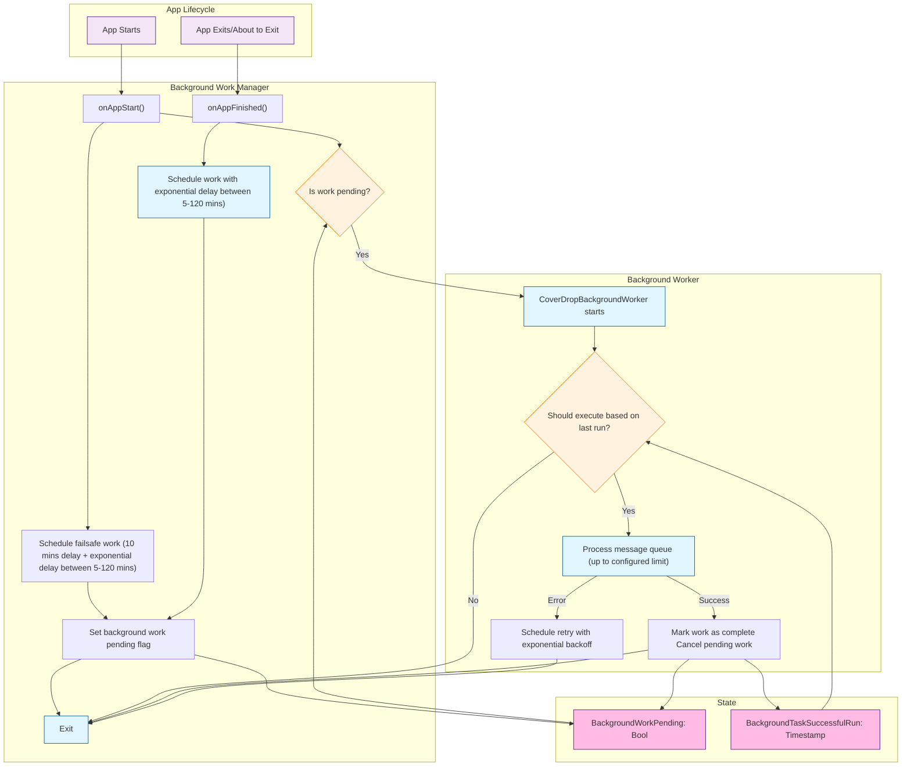

# Background message sending

## iOS

Background message sending is only triggered by background scheduled tasks using the `BGAppRefreshTaskRequest` https://developer.apple.com/documentation/backgroundtasks/choosing-background-strategies-for-your-app#Update-Your-Apps-Content

We schedule background-scheduled tasks when the app enters the background and when the app starts.
We do this extra scheduling at the app start with an extra delay just in case the onAppFinish function does not get called.

If the app starts and message sending work is listed as pending, we try and dequeue and send messages immediately.
As the `BackgroundMessageSendService.run` checks for a) recent run, the message sending may be rate limited, and not run this time.
If the app starts, but no work is pending, we will and add another background task to run in 10 min + an exponential delay.

## Diagram



## Functions

### `BackgroundMessageSendService.run`

This tries to dequeue and send background messages
This function implements rate limiting, so will only run once every `minDurationBetweenBackgroundRunsInSecs` which is set to once per hour in production
It also supports the case where the clock has jumped forwards, so will run in this scenario too.

### ``

### `BackgroundMessageScheduleService.onAppStart`

This will fire every time the app starts from a cold start - ie the app is not currently running in the background.
This is done by putting a call in `didFinishLaunchingWithOptions` app delegate function.

### `BackgroundMessageScheduleService.scheduleBackgroundTask`

This is called when the app enters the background from `applicationDidEnterBackground` in app delegate
This will overwrite any previously scheduled background tasks with this most recent one

## State

We store 2 state values related to background message sending
`BackgroundWorkPending` - This is set in `PublicDataRepository.shared.writeBackgroundWorkPending()` function which is backed by a `UserDefaults` value stored on the device
`BackgroundJobLastSuccessfulRun` - This is set in `PublicDataRepository.shared.writeBackgroundJobLastSuccessfulRun()` function which is backed by a `UserDefaults` value stored on the device

```

```
