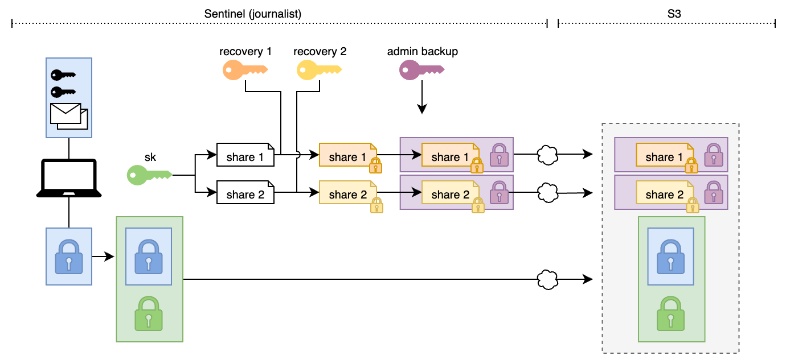
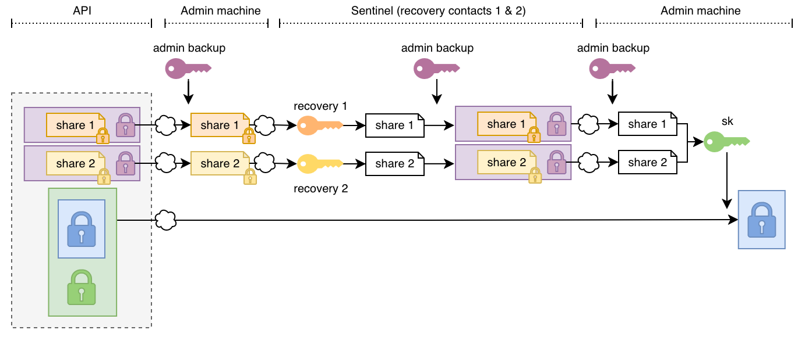

# Forward-Secure Cloud-Based Backups with Social Recovery

CoverDrop provides an automatic backup option for journalist clients (Sentinel).
While journalist client vaults are protected with a passphrase, we want to provide an additional layer of encryption with forward secrecy to protect against later passphrase compromise.
To achieve this, we use a cloud-based backup system with social recovery.

## Threat model

We design the backup system to provide additional availability guarantees without adding significant risk to the confidentiality of the vaults.
The threat model we consider is as follows:

- Device loss or failure: The journalist's device may be lost, stolen, or fail, making local backups inaccessible.
- Passphrase compromise: The journalist's vault passphrase may be compromised at a later date.
- Cloud provider compromise: The cloud backup provider may be compromised and might collude with an attacker who has access to the journalist's passphrase.

We have the following security goals:

- Availability: The journalist should be able to recover their vault within a day if their device is lost or fails. They should be able to recover all messages encrypted with any of the backed-up keys.
- Forward secrecy: Even if the journalist's vault passphrase is compromised, previous backups should remain secure.
- Social recovery: The backup system should allow recovery of backups only with the cooperation of multiple trusted parties (e.g., other journalists).
- Traceability: Recovery processes require interaction with the CoverDrop administration team to prevent unrecognized recovery attempts.
- Flexibility: Journalists should be able to choose trusted parties for social recovery in a way that matches their trust in those parties.

## System overview

We describe the backup procedures with reference to the diagram below and the types used in the Rust implementation.

1. The journalist client reads the vault file (as it is stored on disk, encrypted with the passphrase) and pads it to the next multiple of 1 MiB. See: `SteppingPaddedByteVector`.
2. The journalist client generates an ephemeral secret key `sk` and uses this key to encrypt the `SteppingPaddedByteVector` using an authenticated symmetric encryption scheme. The resulting ciphertext is referred to as the "backup encrypted padded vault".
3. The secret key `sk` is then split into `n` shares using Shamir's secret sharing scheme with a threshold of `k` shares required for reconstruction. Each share is referred to as a `SecretSharingShare`. We might choose k=1 for a trivial secret sharing scheme.
4. Each share is then encrypted for the chosen recovery contacts under their latest messaging public key. The resulting ciphertexts are referred to as `EncryptedSecretShare`.
5. Each `EncryptedSecretShare` is encrypted once more under the backup public key (referred to as a backup "messaging key" in the hierarchy), resulting in a double-encrypted secret share. See: `BackupEncryptedSecretShare`.
6. The journalist client then uploads the "backup encrypted padded vault" along with the double-encrypted secret shares to S3.



To recover a backup, the admin team and the recovery contacts need to cooperate as follows:

1. The journalist contacts the CoverDrop admin team to initiate a recovery process. The admin team verifies the journalist's identity and authorizes the recovery process.
2. The admin team retrieves the "backup encrypted padded vault" and the double-encrypted secret shares from the S3 backup store.
3. The admin team decrypts each double-encrypted secret share using the backup private key to obtain the `EncryptedSecretShare`s. This is done on a dedicated offline machine to protect the sensitive backup private key.
4. The encrypted secret shares are output as Base64 strings and securely transmitted to the recovery contacts, e.g., using an ephemeral Signal chat.
5. The recovery contacts recover their respective `EncryptedSecretShare` using trial decryption with their messaging private keys. The resulting `SecretSharingShare` is then re-encrypted under the admin team's messaging public key and sent back to the admin team.
6. The admin team collects at least `k` re-encrypted `SecretSharingShare`s from the recovery contacts and decrypts them using their messaging private key.
7. The admin team reconstructs the secret key `sk` using the `k` decrypted `SecretSharingShare`s and then decrypts the "backup encrypted padded vault" to recover the journalist's vault.



## Backup Public Key Family

This is the shape of the response for backup keys for the `public-keys` endpoint:

```json
{
    "keys": [
        {
            "org_pk": {
                "key": "1037f9c40656adb2cc469e68758015c2d90f252c94eae10c4bf38c40d25f67b3",
                "certificate": "46df10d92a1be0bce3eb8208ce16c61f4f93883c51f86feba307e817f764361c0f129e4d213f5d3ffcf597a30a3893794bec67fb12fe17da43afc4345f686a01",
                "not_valid_after": "2026-03-04T09:37:36.830461067Z"
            },
            {
                "backups": [
                    {
                        "id_pk": {
                            "key": "36059c4c5be32635cc6eaf538b0703ae68b055a0c1dffb156d6d7ca1821328da",
                            "certificate": "8b204a690ad711cee20b81f372568a4c2f8f610b461fe731fe1cfabd3de8ae9e59f6aca1ce6cac57e4eebb9ed30320eccefcf47b914a20972db6b207749ceb0d",
                            "not_valid_after": "2025-10-09T17:31:47.509054799Z"
                        },
                        "msg_pks": [
                        {
                            "key": "6f1ed5697898a9470e41e4d5dd5e10bcf65a6cd045de66fa808768abf8a5153e",
                            "certificate": "877b68833d13785687850060cc3ed2589a68183d383f8a545992a34f27da1c0e4cf05a52c1bbe5887058c67793bf5e843bb7afd01bec4101084901acd9034a00",
                            "not_valid_after": "2025-10-03T00:42:45.724717606Z"
                        },
                    }
                ]
            }
        }
    ]
}
```
