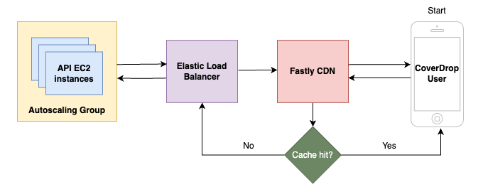

# Fastly CDN

Our production[^1] API sits behind Fastly's Content Delivery Network, which provides a layer of caching.

Below is a diagram showing the journey of a request from a user's device to the API application and back.



Fastly uses [VCL](https://docs.fastly.com/en/guides/guide-to-vcl) (Varnish Configuration Language) to define the response behaviour. They also provide a user-friendly [web interface](https://manage.fastly.com/services/all) that acts as a level of abstraction: changes made through the web interface generate new VCL, which can then be inspected.

## Service configuration

TLS is enabled on the AWS elastic load balancer, which ensures a private and unmodified connection between Fastly and the origin server. Fastly automatically enables TLS for hosts on port `443`.


The service is also configured to force TLS between the CDN and the user: whenever an insecure HTTP connection is attempted, the response is a `301` redirect to the HTTPS equivalent.
This was achieved by creating a custom request setting through the web interface (`Settings > Request Settings > Create Request Setting`) as per image below:


The generated VCL is as follows (`F_API_load_balancer` is a reference to the backend, i.e. the load balancer):

```
  set req.backend = F_API_load_balancer;
  if (!req.http.Fastly-SSL) {
     error 801 "Force SSL";
  }

  if (obj.status == 801) {
     set obj.status = 301;
     set obj.response = "Moved Permanently";
     set obj.http.Location = "https://" req.http.host req.url;
     synthetic {""};
     return (deliver);
  }
```

You can convince yourself that the redirect is happening by sending a GET requests to the [`/v1/healthcheck`](http://secure-messaging-api.guardianapis.com/v1/healthcheck) endpoint using `curl` with verbose options on and inspecting the response.

<details>
<summary>See full response</summary>

```
$ curl -vvv http://secure-messaging-api.guardianapis.com/v1/healthcheck -L

- Trying 151.101.65.111:80...
- Connected to secure-messaging-api.guardianapis.com (151.101.65.111) port 80 (#0)
  > GET /v1/healthcheck HTTP/1.1
  > Host: secure-messaging-api.guardianapis.com
  > User-Agent: curl/8.1.2
  > Accept: _/_
  >
  > < HTTP/1.1 301 Moved Permanently
  > < Connection: close
  > < Content-Length: 0
  > < Server: Varnish
  > < Retry-After: 0
  > < Location: https://secure-messaging-api.guardianapis.com/v1/healthcheck
  > < Accept-Ranges: bytes
  > < Date: Wed, 06 Dec 2023 16:51:21 GMT
  > < Via: 1.1 varnish
  > < X-Served-By: cache-lcy-eglc8600025-LCY
  > < X-Cache: HIT
  > < X-Cache-Hits: 0
  > < X-Timer: S1701881482.781228,VS0,VE61
  > <
- Closing connection 0
- Clear auth, redirects to port from 80 to 443
- Issue another request to this URL: 'https://secure-messaging-api.guardianapis.com/v1/healthcheck'
- Trying 151.101.65.111:443...
- Connected to secure-messaging-api.guardianapis.com (151.101.65.111) port 443 (#1)
- ALPN: offers h2,http/1.1
- (304) (OUT), TLS handshake, Client hello (1):
- CAfile: /etc/ssl/cert.pem
- CApath: none
- (304) (IN), TLS handshake, Server hello (2):
- (304) (IN), TLS handshake, Unknown (8):
- (304) (IN), TLS handshake, Certificate (11):
- (304) (IN), TLS handshake, CERT verify (15):
- (304) (IN), TLS handshake, Finished (20):
- (304) (OUT), TLS handshake, Finished (20):
- SSL connection using TLSv1.3 / AEAD-CHACHA20-POLY1305-SHA256
- ALPN: server accepted h2
- Server certificate:
- subject: CN=theguardian.com
- start date: Nov 14 10:45:28 2023 GMT
- expire date: Dec 15 10:45:27 2024 GMT
- subjectAltName: host "secure-messaging-api.guardianapis.com" matched cert's "\*.guardianapis.com"
- issuer: C=BE; O=GlobalSign nv-sa; CN=GlobalSign Atlas R3 DV TLS CA 2023 Q4
- SSL certificate verify ok.
- using HTTP/2
- h2 [:method: GET]
- h2 [:scheme: https]
- h2 [:authority: secure-messaging-api.guardianapis.com]
- h2 [:path: /v1/healthcheck]
- h2 [user-agent: curl/8.1.2]
- h2 [accept: */*]
- Using Stream ID: 1 (easy handle 0x13980d800)
  > GET /v1/healthcheck HTTP/2
  > Host: secure-messaging-api.guardianapis.com
  > User-Agent: curl/8.1.2
  > Accept: _/_
  >
  > < HTTP/2 200
  > < content-type: application/json
  > < cache-control: max-age=1
  > < accept-ranges: bytes
  > < date: Wed, 06 Dec 2023 16:51:21 GMT
  > < via: 1.1 varnish
  > < age: 0
  > < x-served-by: cache-lcy-eglc8600058-LCY
  > < x-cache: MISS
  > < x-cache-hits: 0
  > < x-timer: S1701881482.870108,VS0,VE52
  > < content-length: 15
  > <
- Connection #1 to host secure-messaging-api.guardianapis.com left intact
  {"status":"ok"}%
```

</details>

> [!NOTE]
> Note that TLS terminates at the load balancer. [CDK](../cdk/lib/api.ts) ensures that the API EC2 instances are only accessible by the load balancer and are not open to the public internet.

> [!IMPORTANT]
> The load balancer is open to the public internet. This means that it is possible to bypass Fastly and hit the load balancer directly. In the future, we may want to restrict the CIDR range of the load balancer's security group so that it is only accessible by Fastly IP addresses.

## Caching

Responses served by Fastly have a default TTL of `3600` seconds (one hour). While cache settings can be overridden in the web interface (under `Settings > Cache Settings`), we prefer setting a `cache-control` header for specific API endpoints at the application level.

When the application serves a response that includes a `cache-control` header, it will override Fastly's default TTL.
You can find all TTLs that we have manually defined for the API in [this file](../api/src/cache_control.rs).

[^1]: Unless otherwise specified, the same settings will apply to the equivalent services created for the security audit.
