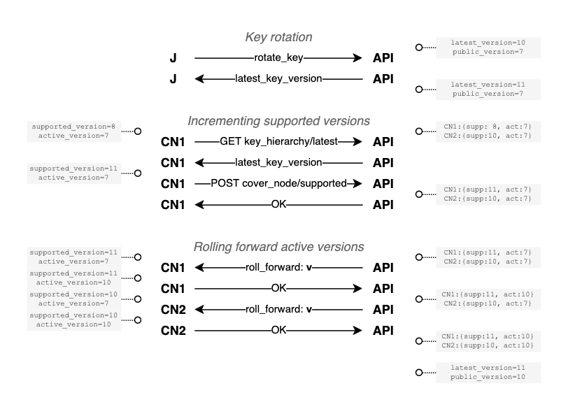

# Key propagation

The participants of the CoverDrop system use keys to both encrypt/decrypt messages and sign other keys.
In order to provider Forward Security, i.e. to ensure that a compromise of a key does not compromise the security of past messages, we rotate keys.
See the [key rotation](key_rotation.md) document for more background on our design decision.
This means that the keys used to encrypt messages are changed regularly.
When journalists and CoverNodes rotate their keys, these are propagated to the API who will eventually publish them as part of the overall key hierarchy.
However, since participants might see these updates at different points in time, we need to ensure that clients only try to decrypt messages when they have the necessary keys.
This document describes how we achieve this.

## Overview

For our discussion we consider a simplified setup consisting of the API, a journalist (J), multiple cover node (CN1, CN2), a user (U).
The simplification to just one journalist and one user comes with no loss of generality, as there is on interdependency between the two different users (or two different journalists).
However, we will see that the CoverNodes need to agree on the active epoch and as such we need to discuss their interaction.
The API is centralized infrastructure that we trust to be available and act in an honest-but-curious manner, i.e. it will not actively try to subvert the system but might try to learn information from the messages it processes.

The following picture illustrated the overall setup and the general flow of messages and key updates.
**Dashed lines** indicate messages, **solid lines** indicate key updates.


## The naive approach and its error cases

We first discuss a naive approach to key propagation and then show how it can fail in certain scenarios.
The naive approach is to have the API publish the new keys as soon as they are available.
For instance, once a cover node or journalist publishes a new key, the API will make it available to all participants (including users, cover nodes, and other journalists) when they download the latest key hierarchy.

One possible error case it the following scenario:
- U downloads the latest key hierarchy
- U encrypts a messages first with the latest key of J (AnonymousBox, U2J) and then with the latest key of CN1 (AnonymousBox, U2C)
- U sends the message to CN1
- CN1 downloads the latest key hierarchy
- J downloads the latest key hierarchy
- CN1 rotates their key and uploads them to the API
- CN1 decrypts the outer layer, re-encrypts it for J (TwoPartyBox, C2J).
- CN1 sends the message to the API
- J downloads the latest dead-drop
- J fails to decrypt the message, since it has not yet downloaded the new key of CN1

The underlying problem here is that there is no causal ordering of the key updates and the generated dead-drops.
I.e. when downloading a dead-drop there is no guarantee that we have downloaded all the keys necessary to decrypt the messages.

## Synchronized key propagation

> [!NOTE]  
> This is work-in-progress and might not be supported yet.

We approach our solution to the problem by discussing the requirements and then describing a protocol that fulfills these constraints.

### Requirements

In our system the cover nodes process messages in a high-throughput manner.
This means that we cannot afford to have them pause and block for key updates.
On the other hand, the end-clients (users and journalists) are not time-critical and can wait for the key updates to be available.
In our protocol this is reflected by having the cover nodes drive the advancement of the key epochs.

Since the system is processing messages coming from millions of clients, the size of those messages is critical for the overall performance.
Therefore, we want to avoid having to include extra metadata in individual messages.
However, we can afford to have some metadata in the dead-drops, as they are only generated once per epoch.

### Protocol

In our protocol we leverage the centralized nature of the API to synchronize the key updates and maintain a consistent state.
This simplifies our design as we move from a decentralized distributed system to a centralized distributed one.

We introduce the following terminology and state to precisely describe the protocol. 
Note that we intentionally do not re-use the same state name across different services so that we can easily distinguish between them.

- The **CoverNodes** internally maintain the following state:
  - **Supported key version:** The latest key version that they have downloaded and could be using.
  - **Active key version:** The key version that they are currently using to decrypt/encrypt messages.
- The **API** internally maintains the following state:
  - **Latest key version:** Increments for every received key update and is served under `GET /v1/key_hierarchy/latest`.
  - **Public key version:** The version served to clients under `GET /v1/key_hierarchy/public`.
  - **CoverNode key version table:** This table maps each CoverNode to their _supported key version_ and _active key version_.
- **Epoch:** the dead-drop epoch is a monotonically increasing number that is incremented whenever a new user or journalist dead-drop is generated. This number is independent of the key version numbers.
- **Dead-drop key version:** every dead-drop contains a meta-data field that indicates the required key version to decrypt the messages.

In a nutshell the protocol works as follows.
We provide a more detailed description in the remainder of the section using explicit pseudocode algorithms.
One general principle is that clients and cover nodes always try to decrypt with all their known keys, but only are allowed to encrypt using keys of the **public key version**.

Whenever a journalist or CoverNode rotates their key, they perform a POST request to the API providing their new key material signed with their long-lived identity key.
This internally increments the **latest key version** on the API and the new key will be served under the `/v1/key_hierarchy/latest` endpoint.
The CoverNodes regularly download the latest key hierarchy and update their **supported key version**.
When a CoverNode has downloaded the latest key hierarchy and sees that the **latest key version** has changed, it internally increases its **supported key version**.
If that happens, it lets the API know via `POST /v1/key_hierarchy/covernode/supported` which updates the respective field in the **CoverNode key version table**.

After one of these updates, the API might observe that it the supported key version **v** of all cover nodes is higher than the **public key version**.
If that is the case, it will send a message to each of them, asking them to update their **active key version** to **v**.
Once it received an OK from all of them, the API sets the **public key version** to **v**.
Likewise, the CoverNodes start to use their new keys that are included in the **public key version** key hierarchy and set the metadata field **dead-drop key version** accordingly.

When journalists or users process such dead-drops, they will check that their local key hierarchy version is at least as high as the **dead-drop key version**.
If that is not the case, they know that they can receive it from the API.

### Example run

The following diagram shows a possible run of the protocol.
We start with the following states:
- The API has **latest key version** 10 and **public key version** 7.
- CoverNode 1 has **supported key version** 8 and **active key version** 7.
- CoverNode 2 has **supported key version** 10 and **active key version** 7.

First a journalist rotates their key and sends it to the API.
The API increments the **latest key version** to 11 and serves the new key under `/v1/key_hierarchy/latest`.
Then CoverNode 1 downloads the latest key hierarchy and updates its **supported key version** to 11.
This in turn also updates the **CoverNode key version table** on the API.
Finally, the API decides to roll the active version forward to **v=10** which it knows the highest version both cover nodes support.
It sends a message to CoverNode 1 to update its **active key version** to 10.
It also sends a message to CoverNode 2 to update its **active key version** to 10.
Once both have confirmed, the API updates the **public key version** to 10.



### Detailed protocol

We now describe the protocol in more detail using explicit pseudocode algorithms.
In those algorithms we assume for simplicity that the API can send messages to the cover nodes.
However, in our production setup we use a pull-based approach where the CoverNodes regularly poll the API for updates.

#### Journalist key rotation

Key rotation requests contain the key and a signature to verify the authenticity of the request.
The response from the API includes the **latest key version** number and we store that with the key so that can later "activate" that key for encryption. when the **public key version** is greater-than-or-equal this number.
The same logic applies for the cover nodes.

```python
# Journalist / CoverNode (executed regularly)
def rotate_key(new_key):
    resp = post_to_api("/v1/...", new_key, sign(new_key))
    new_key.active_from_version = resp.latest_key_version
```

On the API the logic looks as follows:

```python
# API
def on_post_rotate_key(self, new_key, signature):
    if verify_signature(new_key, signature):
        self.latest_key_version += 1
        db.store_key(new_key, self.latest_key_version)
        return {"latest_key_version": latest_key_version}
    else:
        return {"error": "invalid signature"}
```    

#### Update of supported version

The CoverNodes regularly download the latest key hierarchy and update their **supported key version**.
If the **latest key version** has changed, they let the API know.
The respective code on the API is straight-forward:

```python
# CoverNode (executed regularly)
def check_for_key_update(self):
    resp = get_from_api("/v1/key_hierarchy/latest")
    if resp.latest_key_version > self.supported_key_version:
        self.supported_key_version = resp.latest_key_version
        post_to_api("/v1/key_hierarchy/covernode/supported", self.supported_key_version)

# API
def on_get_latest_key_hierarchy(self):
    hierarchy = db.key_hierarchy(self.latest_key_version)
    return {"latest_key_version": self.latest_key_version, "hierarchy": hierarchy}

# API
def on_covernode_supported_version_update(self, cover_node_id, supported_key_version):
    self.cover_node_key_versions[cover_node_id].supported_key_version = supported_key_version
    return 'OK'
```

#### Rolling forward the active version

When the API observes that all CoverNodes have a **supported key version** that is higher than the **public key version**, it sends a message to each of them to update their **active key version**.
Once all have confirmed, it updates the **public key version**.

```python
# API (executed regularly)
def check_for_active_key_version_update(self):
    table_state = self.cover_node_key_versions.values()
    max_supported_version = max([x.supported_key_version for x in table_state])
    if max_supported_version > self.public_key_version:
        new_version = max_supported_version
        for cover_node_id in self.cover_node_key_versions:
            resp = post_to_covernode(cover_node_id, 'set_active_version' new_version)
            if resp == 'OK':
                self.cover_node_key_versions[cover_node_id].active_version = new_version

# CoverNode
def on_set_active_version(self, version):
  self.active_key_version = version
  return 'OK'
                
# API (executed regularly, and after each execution of the above method)
#
# Note: this is not part of the above API method to allow for asynchronisity and late
# updates in the pull-based implementation
def maybe_update_public_key_version(self):
    table_state = self.cover_node_key_versions.values()
    max_active_version = max([x.active_version for x in table_state])
    if max_active_version > self.public_key_version:
        self.public_key_version = max_active_version

# API
def on_get_public_key_hierarchy(self):
    hierarchy = db.key_hierarchy(self.public_key_version)
    return {"public_key_version": self.public_key_version, "hierarchy": hierarchy}
```
