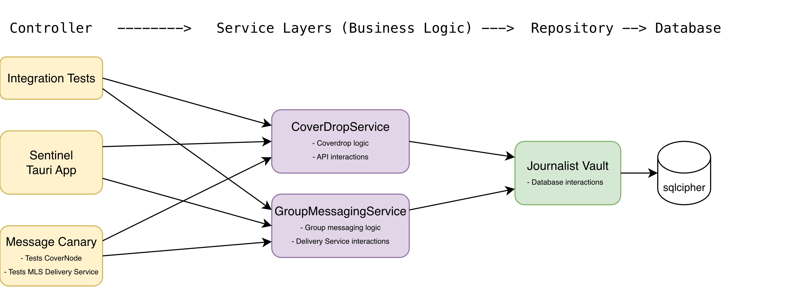

# journalist-services

Service layers that encapsulate the business logic of Sentinel, the journalist client.

## Crates

- **[coverdrop-service](./coverdrop-service/)** — Core CoverDrop protocol operations (dead drop polling, message decryption/encryption, key rotation).
- **[group-messaging-service](./group-messaging-service/)** — MLS-based group messaging between journalists via the delivery service.

## Design

Putting logic in these service layers (rather than directly in the Tauri command handlers) makes it more testable. Both services are used as entrypoints by:

- The **Tauri app** (journalist-client) for production use.
- **Integration tests** for end-to-end testing.
- The **message canary** for production tests / monitoring.

## Diagram

