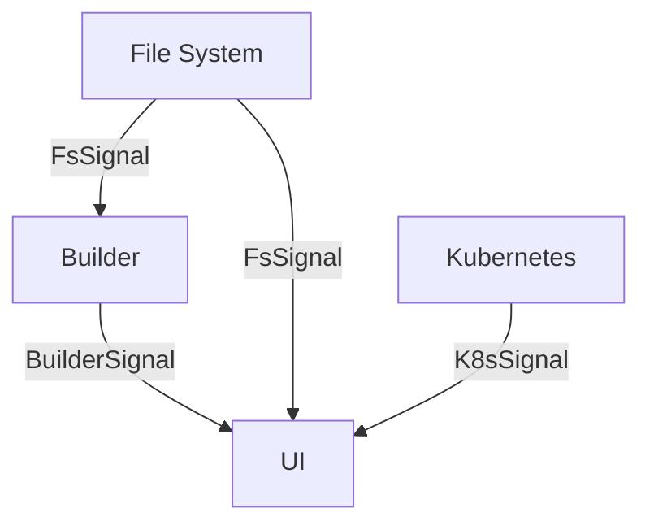

# `watch` functionality

This module contains the main components used in the `dev watch` command.

Several tasks are spawned which gather information and forward them to the UI
and to a builder.

The UI displays information on if the crates are `dirty` (need rebuilding) or `clean`. It also
shows information about the state of the kubernetes cluster, such as the pods running for each service.
